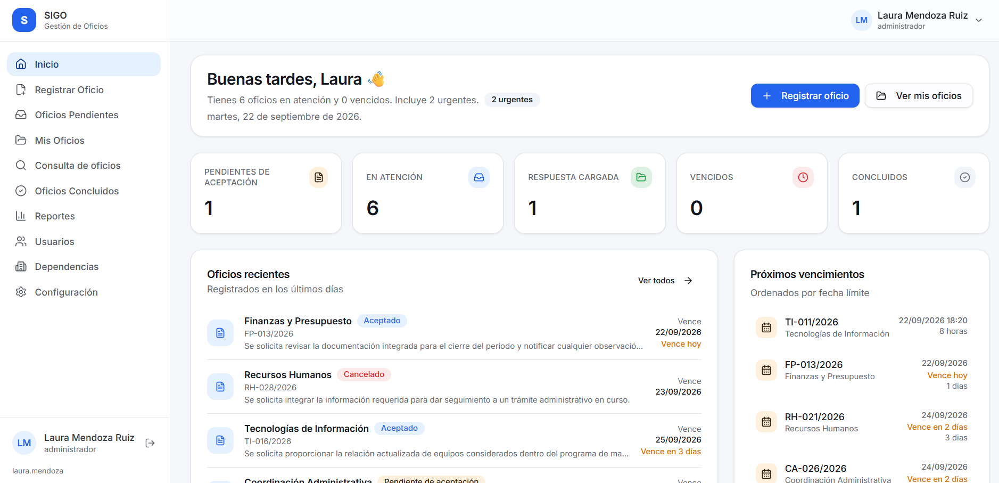
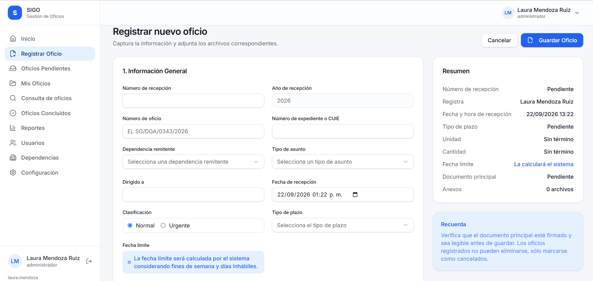
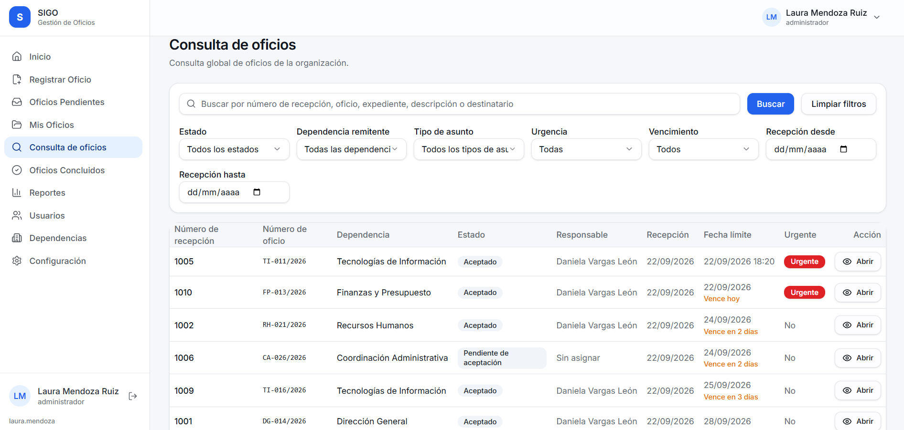
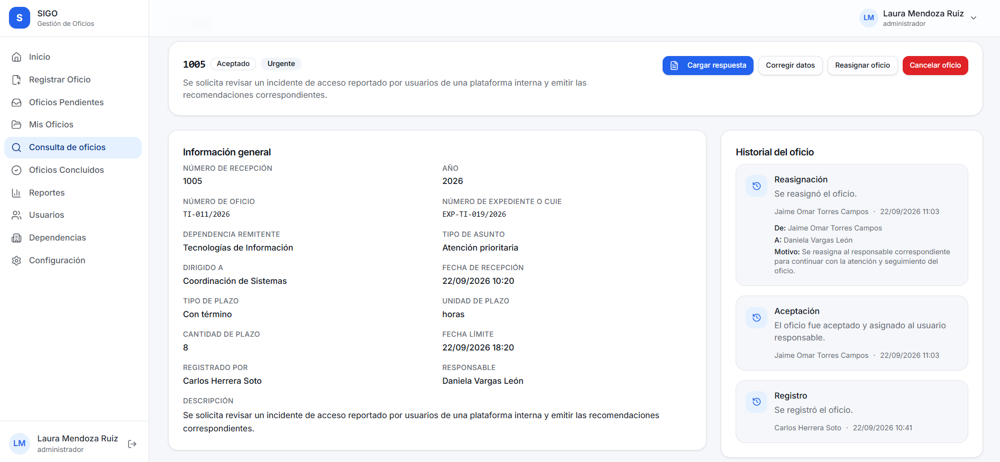

# SIGO — Sistema de Gestión de Oficios

SIGO es un sistema web desarrollado para digitalizar y facilitar la recepción,
asignación, seguimiento y conclusión de oficios dentro de una organización.

El sistema permite gestionar usuarios, dependencias, documentos y el flujo de
los oficios desde su recepción hasta su conclusión.

## Tecnologías

- React
- TypeScript
- PHP
- MySQL
- Docker
- Git / GitHub

## Roles del sistema

- Administrador
- Recepción
- Usuario operativo

## Funcionalidades principales

- Registro y recepción de oficios
- Asignación y aceptación de oficios
- Gestión de documentos adjuntos
- Seguimiento del estado de cada oficio
- Reasignación de oficios
- Gestión de usuarios y dependencias
- Generación de reportes
- Control de permisos según el rol del usuario

## Capturas del sistema

### Panel principal

Vista general del sistema con el estado de los oficios, próximos vencimientos
y accesos a las principales funciones.

### Registro de oficios

Formulario para registrar la información del oficio, su clasificación,
plazo y documentación correspondiente.

### Consulta y seguimiento

Consulta general de oficios mediante filtros por estado, dependencia,
tipo de asunto, urgencia y fechas.

### Historial del oficio

Detalle del oficio e historial de las acciones realizadas durante su
seguimiento.

## Estado del proyecto

El sistema se encuentra desarrollado y en etapa de implementación.

Para su operación dentro de la organización, SIGO será desplegado mediante
Docker en un equipo destinado como servidor local, permitiendo que los usuarios
accedan al sistema desde los equipos conectados a la red interna.
